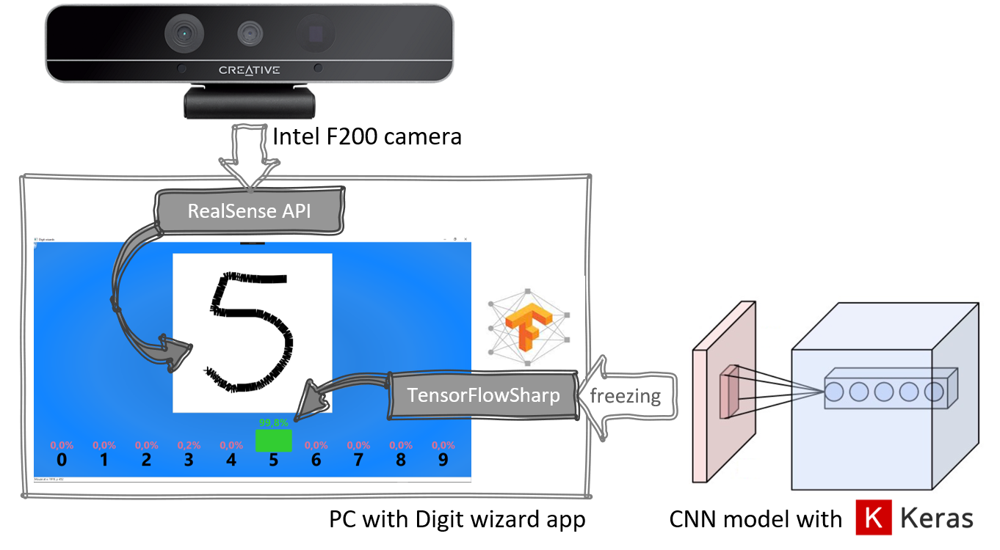
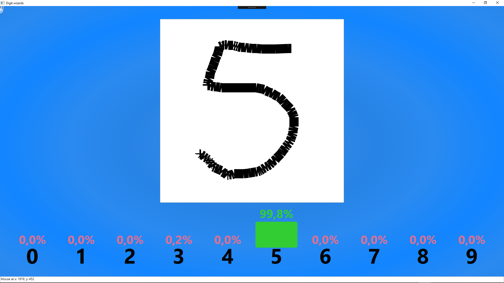
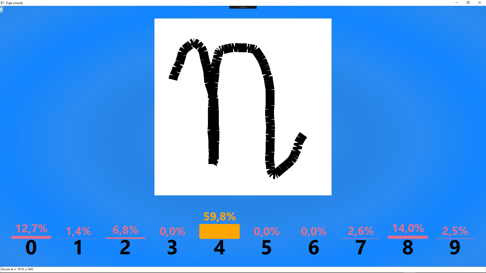

# DigitWizard
Hand gesture recognition based on Intel RealSense API makes a lot of fun. In this app it was used to draw sketches on the canvas. Sketches drawn are given as input to the CNN model, trained to recognize handwritten digits.

### Overview
Ths application was built utilizing the core of *Touchless Controller Viewer* sample from the Intel RealSense SDK [[1]](http://registrationcenter.intel.com/irc_nas/9078/release_notes_realsense_sdk_2016_r2.pdf). <br>In this modification by dragging a mouse or by moving a closed fist one can draw on the canvas. After mouse button is released or hand fist is opened a drawn sketch is resized to 28x28 px picture. It can be then given as input to a Convolutional Neural Network model, which was trained on the MNIST dataset [[2]](https://github.com/keras-team/keras/blob/master/examples/mnist_cnn.py). The trained model was frozen [[3]](https://stackoverflow.com/questions/45466020/how-to-export-keras-h5-to-tensorflow-pb/45466355#45466355) and loaded within C# app thanks to the TensorFlowSharp [[4]](https://github.com/migueldeicaza/TensorFlowSharp). In order to present the CNN model output, modification of the smart bar charts solution [[5]](http://dotnetvisio.blogspot.com/2013/08/wpf-create-custom-bar-chart-using-grid.html) was applied. 
<br><br>
<p align="center"></p>

### Usage
* **Drawing:** user can draw digits on the canvas utilizing mouse or by performing a gestures in the air when F200 depth camera is turned on. In order to start drawing with a hand, fist has to close. All shapes (digits) have to be drawn with one curve only.
* **Cleaning the canvas:** each attempt to draw new shape cleares the canvas. Also a waving hand gesture clears it.
* **See the results:** after a sketch is completed, it is resized and given as input to the CNN model and bar chart indicating the percentage of recognition certainity for given digit is drawn under the canvas.

| Good sign recognized |  Bad sign - model is confused |
|----------------|----------------|
| <p align="center"></p> | <p align="center"></p>  |

### Loading data to CNN model in TensorFlowSharp
```cs
float[,,,] CNN_input = new float[1, 28, 28, 1]; // array to store resized sketch

/*
/-- here are transforms of canvas sketch into float array
*/

using (var graph = new TFGraph())
{
  graph.Import(File.ReadAllBytes("my_model.pb"), "");
  var session = new TFSession(graph);
  var runner = session.GetRunner();

  runner.AddInput(graph["conv2d_1_input"][0], new TFTensor(CNN_input)); // input
  runner.Fetch(graph["dense_2/Softmax"][0]); // output

  var output = runner.Run();

  TFTensor result = output[0];
  var re = (float[,])result.GetValue();

  for (int i = 0; i < re.Length; i++)
  {
      Console.WriteLine(re[0, i]); // console test
      _bar[i].Value = (int)(100 * re[0, i]); // value for bar height
      _bar[i].AccVal = String.Format("{0:0.0}%", 100 * re[0, i]); // value for bar label
  }
  this.DataContext = new RecordCollection(_bar); // refresh the bar chart
}
```
### Requirements & remarks
* The solution was tested with **RealSense F200 depth camera**
* **TensorflowSharp 1.7.0** package needs to be installed from _nuget_ (I didn't put it to repo as it weights +200MB)

### References
[1] [*Intel® RealSenseTM SDK 10.0.26.0396*](http://registrationcenter.intel.com/irc_nas/9078/release_notes_realsense_sdk_2016_r2.pdf)  
[2] [*Keras MNIST-CNN demo*](https://github.com/keras-team/keras/blob/master/examples/mnist_cnn.py)  
[3] [*Keras models freezing script*](https://stackoverflow.com/questions/45466020/how-to-export-keras-h5-to-tensorflow-pb/45466355#45466355)  
[4] [*TensorFlowSharp: .NET bindings to the TensorFlow*](https://github.com/migueldeicaza/TensorFlowSharp)  
[5] [*Smart WPF bar charts*](http://dotnetvisio.blogspot.com/2013/08/wpf-create-custom-bar-chart-using-grid.html)
